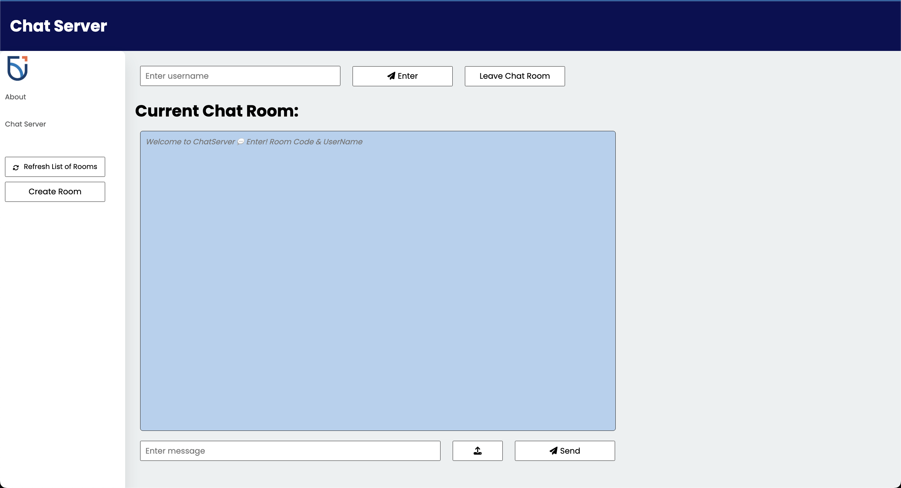

# Web Chat Server

## Project Information

Chat Server is a simple chat application that allows users to create chat rooms and chat with other users in real-time.
Users can create chat rooms, join chat rooms, and send messages to other users in the chat room.
The application is built using Java EE, Maven and WebSocket.

### Application Images

#### Chat Server Page Screenshot

## Features

The following improvements have been made to the interface and interaction functionalities of the Chat Server:

* **Create Chat Rooms**: Users can now create their own chat rooms.
* **List of Chat Rooms**: A list of all available chat rooms is displayed on the sidebar, allowing users to see all the chat rooms they can join.
* **Refresh List of Chat Rooms**: A "Refresh" button has been added that updates the list of chat rooms in real-time.
* **Hover Effect on Buttons**: All buttons now have a hover effect to improve user interaction and provide visual feedback.
* **Join Chat Rooms**: Users can now join any available chat room from the list.
* **Real-Time Stamps**: Each message now has a timestamp, providing real-time context to the chat.
* **Upload Images or Document Files**: Users can now upload images or document files in the chat room.
* **Send Messages**: Users can send messages to other users in the chat room in real-time.
* **Leave Chat Room Button**: A "Leave" button has been added that allows users to exit a chat room.
* **Mentions When a User Leaves or Joins a Chat Room**: The chat now includes system messages that announce when a user joins or leaves a chat room.
* **Load Previous Chat Log History**: When a user enters a chat room, any previous chat history in that room is loaded and displayed.

## How to Run

Follow these steps to run the application:

1. Open project directory as an IntelliJ IDEA project.
2. Setup GlassFish configuration with the provided URL: [http://localhost:8080/WSChatServer-1.0-SNAPSHOT/](http://localhost:8080/WSChatServer-1.0-SNAPSHOT/)
3. Run the project to open the Chat Server application in your web browser
4. Create a chat room or Refresh and join Existing Chat room
5. Start by enter username and begin to chat with other users in the chat room!
